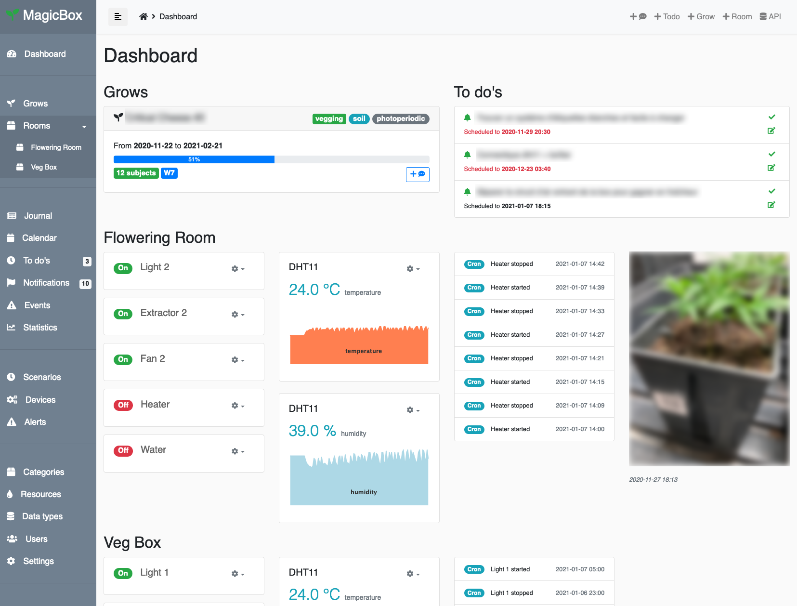
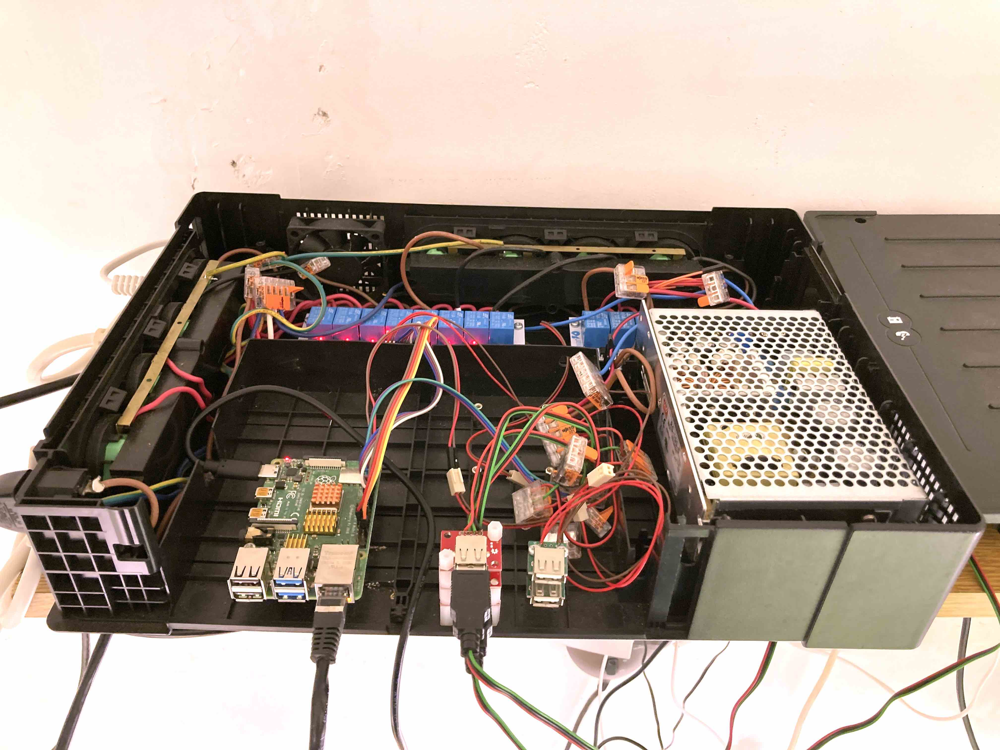

# MAGICBOX

The MagicBox project is a set of hardware and software tools organized together that provides an open indoor growing platform. The system aims to assist home growers in monitoring, scheduling and fine tuning of their growing environments.

*Magicbox dashboard page*

## How it works?

### Background

While ago when I started growing plants indoor, I realized that one important part of the success of operations relies on technology. Lights, air quality and environmental parameters have to be managed carefully to mimic nature in a way your plants benefit of the best environment for them to grow efficiently.

At the beginning like many growers, I bought all the usual equiments separatelly and managed them through a mess of cables, socket multipliers and schedulers. It worked well but was irritating the software engineer inside me, by the lack of centralized control and monitoring.

So I recycled an old power inverter enclosure with 8 female 220V integrated plugs and I put every components I needed in it. Power plugs are managed by 5v relays through GPIO pins of a Raspberry Pi 4 computer board. I also connected DHT11 temperature and humidity sensors with home-made USB cables and connectors to monitor the environmental parameters. All the 5V components are powered by a Meanwell power supply also embedded in the case.

*Recycled power inverter enclosure*

On the software side, it uses a Ruby on Rails backend app that manages the whole system. From rooms, devices and sensors, to minimal grow management and scenario-driven orchestration, the web interface provides all the tools needed to manage an indoor garden. 

That said, Magicbox is currently not a seed-to-sale software designed to handle an instrustrial indoor growing operation. It does not provide any tools to manage tracability, retail stocks and client files. It perfectly fits with small home growing installation and for nerdy growers who like DIY.

### Features

* **Multiple rooms and devices management:** organize several grow rooms with their own devices and sensors all connected through GPIO pins on a Raspberry Pi
* **Condition-based growing scenarios:** you can build your own growing scenarios with user defined conditions to schedule and optimize your growing environment
* **Multiple grows management:** follow multiple grows simultaneously, move subjects (usually plants) from grow to grow, room to room, track them with QR codes and post detailed observations about them
* **Growing journal, calendar, todos, notifications and events** give you a global view of operations 
* Support for **pictures from mobile devices and webcams** 
* **Data, charts and statictics** help you to fine tune your setup along the way
* **Role-based users management:** organize your team, share and communicate to increase your productivity

### Limitations

* Rooms/scenarios only support 1 device per device type
* Magicbox is not a seed-to-sale software : no stocks, retail, client, etc. management included
* 3 minutes minimum scheduling: each process cycle is triggered by a cron task running every 3 minutes
* Ruby on Rails framework can be resource-intensive, do not expect too much performance from it on a Raspberry Pi

### Feature goals

* More collaborative feature (journal replies thread, notifications, sharing)
* Use AI to fine tune the environmental parameters and device orchestration

## Requirements

### Hardware

* Raspberry Pi 4 - 4 GB RAM recommended (should work on Pi 3, but slow)
* 8+ channels 5V relay module
* 220V AC
* 5V AC - 10 AMPS recommended
* DHT11 temperature/humidity sensor

### Software

* Raspbian 10 buster (Raspberry Pi OS - Kernel 5.4)
* Ruby 2.7.2
* Rails 5.2.2

### Skills and tools

* Soldering, and tools coming with it
* Being a little confortable with electronic in general
* Mastering Linux is recommended, Ruby and RoR is a must

## Installation

### Dependencies

	sudo apt-get update -q
	sudo apt-get install -qy procps curl ca-certificates gnupg2 build-essential postgresql postgresql-contrib libpq-dev git nodejs apt-utils libmagickcore-dev libmagickwand-dev libxml2 libxslt ruby-dev zlib1g-dev liblzma-dev --no-install-recommends 

### Install Yarn

	sudo curl -sS https://dl.yarnpkg.com/debian/pubkey.gpg | sudo apt-key add -
	sudo echo "deb https://dl.yarnpkg.com/debian/ stable main" | sudo tee /etc/apt/sources.list.d/yarn.list
	sudo apt-get update && sudo apt-get install -y yarn

### Create `magicbox` user

	sudo adduser --disabled-password --gecos "" magicbox

### Install RVM

	sudo gpg2 --keyserver hkp://pool.sks-keyservers.net --recv-keys 409B6B1796C275462A1703113804BB82D39DC0E3 7D2BAF1CF37B13E2069D6956105BD0E739499BDB
	sudo curl -sSL https://get.rvm.io | sudo bash -s stable
	echo "source /usr/local/rvm/scripts/rvm" | sudo tee -a /home/magicbox/.bashrc
	sudo usermod -a -G rvm magicbox

### Install Ruby

	source /usr/local/rvm/scripts/rvm
	rvm install ruby-2.7.2

### Setup PostgreSQL

This will create a dedicated Postgres user named `magicbox`. It is recommended to change the password, do not forget to use the same in the `.env` file we will create later (`DATABASE_PASSWORD` env var).

	sudo -u postgres psql -c "CREATE ROLE magicbox WITH LOGIN PASSWORD 'magicbox';"
	sudo -u postgres psql -c "ALTER ROLE magicbox SUPERUSER CREATEROLE CREATEDB REPLICATION;"

### Setup Ruby

Log as `magicbox` user:

	sudo su magicbox

Select the ruby version to use as default:

	rvm use ruby-2.7.2 --default

### Get sources

Clone source from GitHub:

	git clone https://github.com/nark/magicbox.git

Jump into the project directory

	cd magicbox/

All the following commands will be executed inside the `magicbox/` directory.

### Setup environment variables

Create a `.env` file to setup some environment variables:

	nano .env

Fill it with the following:

	DATABASE_HOST=127.0.0.1
	DATABASE_NAME=magicbox_production
	DATABASE_USER=magicbox
	DATABASE_PASSWORD=magicbox
	OPENWEATHER2_API_KEY=********************************
	ONESIGNAL_APP_ID=********-****-****-****-************
	ONESIGNAL_API_KEY=************************************************
	ONESIGNAL_SAFARI_WEB_ID=web.onesignal.auto.********-****-****-****-************

Change `DATABASE_PASSWORD` according to the password you chose while creating the Postgres user.

### Install Gems 

Install Ruby dependencies:

	gem install sassc -v '2.4.0'
	gem install rmagick -v '4.1.2'
	gem install nokogiri -v '1.11.0'
	bundle install --without development test

### Precompile assets

	RAILS_ENV=production bundle exec rake assets:precompile

### Setup database

	RAILS_ENV=production bundle exec rake db:create
	RAILS_ENV=production bundle exec rake db:migrate
	RAILS_ENV=production bundle exec rake db:seed

### Setup crontab

	EDITOR=nano crontab -e

	*/3 * * * * /bin/bash -l -c 'cd /home/magicbox/magicbox && RAILS_ENV=production bundle exec rake process:run'

### Run once

To verify that the whole setup works properly, you can run the app within its embedded web server :

	RAILS_ENV=production bundle exec foreman start

Then connect to `http://localhost:3000` to login to your Magicbox.

Default admin credentials are :

* Email : `admin@example.com`
* Password : `changeme`

Change them ASAP when connected.

### Run as a service

To run the app properly as a service you need to install the Passenger plugin for `apache2`.

Be sure to execute the following instructions as `sudo` ?

	gem install passenger --no-document

	passenger-install-apache2-module

And follow the wizard instructions to install Passenger.

### Configure Apache virtual host

Create a new virtual host file:

	sudo nano /etc/apache2/sites-enabled/magicbox.domain.org.conf

With the following content, or alike:

	  ServerName magicbox.domain.org

	  <VirtualHost magicbox.domain.org:80 192.168.1.10:80>
	    # Tell Apache and Passenger where your app's 'public' directory is
	    DocumentRoot /home/magicbox/magicbox/public

	    PassengerRuby /home/magicbox/.rvm/gems/ruby-2.7.2/wrappers/ruby

	    # Relax Apache security settings
	    <Directory /home/magicbox/magicbox/public>
	      Allow from all
	      Options -MultiViews
	      # Uncomment this if you're on Apache >= 2.4:
	      Require all granted
	    </Directory>
	    RewriteEngine on
	    RewriteCond %{SERVER_NAME} =magicbox.domain.org
	    RewriteRule ^ https://%{SERVER_NAME}%{REQUEST_URI} [END,NE,R=permanent]
	  </VirtualHost>

### Run with Apache

	sudo chown -R www-data:www-data /home/magicbox/magicbox/public

## Basic configuration

With the `rake db:seed` command executed earlier, some presets has been populated into the database already. 

### Rooms

Rooms represent your growing space. You can create and manage several rooms, and for each one define a set of devices and associated scenarios to orchetrate them. 

The room also host your grow subjects (e.i. plants). You can move your subjects from room to room without effort.

### Devices

#### Device Types

Magicbox supports a known range of device types, as `light`, `extractor`, `fan`, `sensor`, etc. to help you identifying them and organizing your scenarios.

A device is attached to a room, identified with a `Name` in the database and by its GPIO pin number at the hardware level.

#### GPIO setup

The GPIO setup of devices can be a little tricky because you have to carefully track what GPIO pin of the Raspberry Pi is used and for what device. 

Also it can be different 

Magicbox provides a deatiled view of your GPIO pins and attached devices at [http://localhost:3000/admin/dashboard/gpio](http://localhost:3000/admin/dashboard/gpio) to help you fix potential issues.

### Grows

### Scenarios (basic use)

### Users managment

## Advanced configuration

### Alerts (and notifications)

### Weather (Open Weather)

### Notifications (One Signal)

## API Usage

MagicBox provides a RESTful API to interact with over HTTP. Once MagicBox is installed, the API documentation is available at `http://localhost:3000/apidoc`.

The API is currently under development and **not ready for production** yet.

## QEMU RPI 3

I use QEMU to emulate Raspbian (on macOS) for testing purpose. I use the following instructions :

https://docs.j7k6.org/emulate-raspbian-buster-qemu-macos/

	qemu-img convert -f raw -O qcow2 2019-07-10-raspbian-buster-lite.img raspbian-buster-lite.qcow2

	qemu-img resize raspbian-buster-lite.qcow2 +10G

	qemu-system-arm -cpu arm1176 -m 256 \
	  -kernel kernel-qemu-4.19.50-buster \
	  -M versatilepb \
	  -dtb versatile-pb.dtb \
	  -no-reboot \
	  -nographic \
	  -append "dwc_otg.lpm_enable=0 root=/dev/sda2 rootfstype=ext4 elevator=deadline fsck.repair=yes rootwait" \
	  -hda raspbian-buster-lite.qcow2 \
	  -net user,hostfwd=tcp::22222-:22 -net nic
